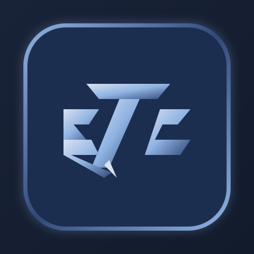
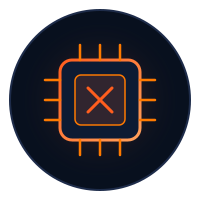
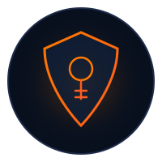
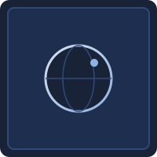

  

<h1 align="center">ETC (Ethical Coders)</h1>

  <strong>Where Challenges Become Skills.</strong> 
  <em>A student cybersecurity & CTF team learning, solving puzzles, and building safer software together.</em>

  

  
  
  
  

---

## Table of Contents

- [About ETC](#-about-etc)
- [Join Us](#-join-us)
- [Team Members](#-team-members)
- [CTF Walkthroughs & Playbooks](#-ctf-walkthroughs--playbooks)
- [Educational & Ethics Notice](#-educational--ethics-notice)

---

## 🛡️ About ETC

**ETC (Ethical Coders)** is a collaborative team of six curious students and ethical hackers. We participate in hands-on **Capture The Flag (CTF)** competitions, explore how computer systems and networks operate under the hood, and document our discoveries through clear, step-by-step walkthroughs and command playbooks.

- **Hands-On Learning**: Solving real-world security challenges across Linux privilege escalation, Web applications, Cryptography, and Digital Forensics.
- **Open Knowledge Sharing**: Documenting step-by-step problem-solving methodologies with embedded proof screenshots so anyone can learn alongside us.
- **Ethical Focus**: Dedicated strictly to defensive learning, authorized lab testing, and making software safer for everyone.

---

## 💬 Join Us

Interested in learning cybersecurity, solving CTF challenges, or collaborating with us? Reach out directly to our team lead on LinkedIn:

  

> Connect with us directly on LinkedIn: [**Harsh Kanojia (harsh-kanojia369)**](https://www.linkedin.com/in/harsh-kanojia369/).

---

## 👥 Team Members

Meet the six students and friends who make up **ETC (Ethical Coders)**:

<table>
  <tr>
    <td align="center" width="50%">
       
      <strong>Harsh Kanojia</strong> 
      <code>TEAM LEAD</code> 
      <em>// Linux & System Security</em>  
      Coordinates team challenges, writes step-by-step walkthroughs, and explores how Linux systems and networks operate under the hood.  
      <code>#TeamLead</code> <code>#Linux</code> <code>#SystemSecurity</code>  
      
      &nbsp;
      
    </td>
    <td align="center" width="50%">
       
      <strong>Kevil</strong> 
      <code>SOFTWARE ANALYSIS</code> 
      <em>// Programs & Memory Security</em>  
      Focuses on how computer programs work inside memory, finding hidden bugs in software code, and understanding how to fix them safely.  
      <code>#SoftwareSecurity</code> <code>#Debugging</code> <code>#CodeAnalysis</code>
    </td>
  </tr>
  <tr>
    <td align="center" width="50%">
       
      <strong>Shloka</strong> 
      <code>CRYPTOGRAPHY</code> 
      <em>// Secret Codes & Math Puzzles</em>  
      Loves solving mathematical riddles, decoding encrypted messages, and learning how modern data privacy algorithms protect information.  
      <code>#SecretCodes</code> <code>#MathPuzzles</code> <code>#DataPrivacy</code>
    </td>
    <td align="center" width="50%">
       
      <strong>Zalak</strong> 
      <code>DIGITAL FORENSICS</code> 
      <em>// Digital Investigation & File Recovery</em>  
      Specializes in finding clues hidden inside pictures and documents, analyzing network records, and restoring damaged file headers.  
      <code>#Investigation</code> <code>#FileAnalysis</code> <code>#DataRecovery</code>
    </td>
  </tr>
  <tr>
    <td align="center" width="50%">
       
      <strong>Dhyey</strong> 
      <code>WEB SECURITY</code> 
      <em>// Website & Web App Testing</em>  
      Tests websites and web forms to discover weaknesses before attackers do, helping developers build safer web applications.  
      <code>#WebSecurity</code> <code>#AppTesting</code> <code>#BugHunting</code>
    </td>
    <td align="center" width="50%">
       
      <strong>Dhruvraj</strong> 
      <code>RESEARCH & RECON</code> 
      <em>// Information Gathering & Discovery</em>  
      Gathers publicly available information and maps out computer networks to help the team understand challenge environments.  
      <code>#Research</code> <code>#PublicInfo</code> <code>#NetworkBasics</code>
    </td>
  </tr>
</table>

---

## 📖 CTF Walkthroughs & Playbooks

All of our writeups and playbooks are written in markdown with embedded screenshots:

| Document | Type | Platform | Key Topics & Techniques | Link |
| :--- | :--- | :--- | :--- | :---: |
| **CatPictures-II Walkthrough** | Full CTF Report | TryHackMe | Image metadata stego, OliveTin RCE, LinPEAS, CVE-2021-3156 (Baron Samedit) root privilege escalation with screenshots | [Read Guide ↗](Tryhackme/CatPictures-II_Full_Walkthrough.md) |
| **U.A. High School Playbook** | Command Playbook | TryHackMe | Reconnaissance, Web command injection, Magic bytes header repair, `eval` sudo root escalation | [Read Guide ↗](Tryhackme/UA_High_School_CTF_Command_Playbook.md) |
| **CTF Command Arsenal** | 10-Phase Cheat Sheet | All Platforms | Comprehensive command reference: Nmap, Gobuster, Ffuf, Reverse shells, Steghide, Hashcat, LinPEAS, GTFOBins | [Read Guide ↗](Tryhackme/CTF_Command_Arsenal.md) |

---

## ⚖️ Educational & Ethics Notice

> [!NOTE]
> All writeups, playbooks, commands, and security research contained in this repository are created strictly for **educational purposes** and **authorized Capture The Flag (CTF) lab environments** (*HackTheBox, TryHackMe, VulnHub, PicoCTF*).
> 
> We do not support or condone unauthorized access to any system, network, or data. Always obtain explicit authorization before testing.

---

  © 2026 ETC (Ethical Coders). All rights reserved.

